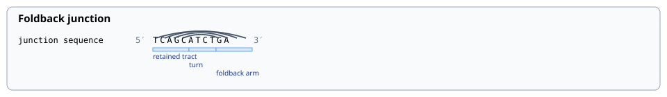
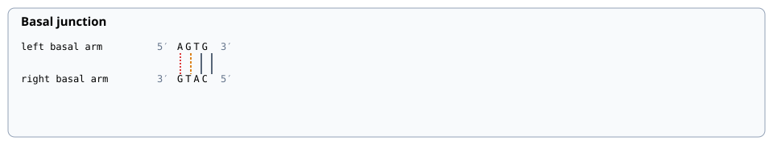

# Render foldback and basal component views

Use this journey to inspect two evaluated hairpin components. It renders only
the relationships already present in the typed evaluations:

- the retained tract, turn, foldback arm, and paired foldback stem; and
- the two antiparallel basal arms with one physical call per base pair.

Run the example from a contributor checkout:

```bash
uv run python examples/render_component_views.py --out build/component-views
```

Open `build/component-views/foldback-junction.svg` and
`build/component-views/basal-junction.svg`. Their sibling JSON files are the
renderer-independent authorities. The SVG files are deterministic projections
of those typed views.





The basal example deliberately contains a hard mismatch, a G:T wobble, and two
Watson–Crick pairs so the visual vocabulary is visible. Its permissive policy is
for software demonstration only; it is not a recommended design or protocol.

## Visual vocabulary

- Gray solid connections are Watson–Crick pairs.
- Amber dashed connections are G:T wobbles.
- Red dashed connections are hard mismatches.
- Blue spans label authored or derived component regions.
- Every sequence track displays explicit 5′ and 3′ termini.

HOP also defines typed views for foldback QA, a released-strand workflow,
terminal basal processing, a composed hairpin-junction route, and a complete
named-method trajectory. Those views require the corresponding evaluated state;
the component example does not invent nicking, release, production, destination
compatibility, or experimental success.

Continue with the [view contract](../reference/view-contracts.md) or the
[provenance boundary](../provenance/overview.md).
